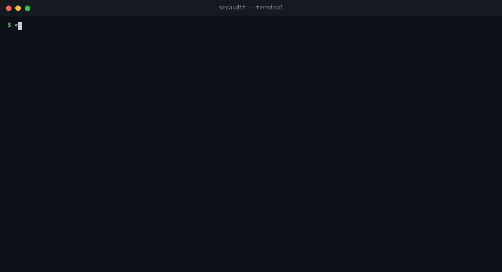

# secaudit

[](https://github.com/MatheusCavalcanteLopes/security-audit-secaudit/actions/workflows/ci.yml)



A lightweight CLI security auditor. Three focused checks, one tool, zero
external scanning services required:

1. **Vulnerable dependencies** — cross-references your `package-lock.json`
   against [OSV.dev](https://osv.dev) (the open-source vulnerability
   database behind `npm audit` and GitHub's own advisories)
2. **Insecure HTTP headers** — checks a live URL against a checklist of
   well-known security headers (HSTS, CSP, X-Frame-Options, cookie flags...)
3. **Leaked secrets** — scans a directory for accidentally committed API
   keys, tokens, and private keys, matching the actual credential *format*
   each provider uses (not just the word "secret")

Built as a portfolio project to demonstrate applied security knowledge —
not just familiarity with the buzzwords, but understanding of *why* each
check matters and how to implement it correctly (e.g. scanning the
lockfile instead of package.json, because only the lockfile has exact
resolved versions; requiring both a credential-shaped regex *and* a
minimum length to avoid false positives).

## Install

```bash
npm install -g secaudit
```

Or run it without installing:

```bash
npx secaudit <command>
```

## Usage

```bash
# Check a project's dependencies for known vulnerabilities
secaudit deps ./my-project

# Check a live site's security headers
secaudit headers https://example.com

# Scan a directory for leaked secrets
secaudit secrets ./my-project

# Run everything at once
secaudit all ./my-project --url https://example.com
```

Exit code is `1` if any `critical` or `high` severity finding is reported —
this makes the tool usable as a CI gate, not just something you run and
read manually:

```yaml
# example: fail the build if secaudit finds anything serious
- run: npx secaudit all . --url https://staging.example.com
```

## Example output

```
🔒 Security Audit Report

Leaked secrets
   CRITICAL  Potential AWS Access Key ID exposed
    src/config.js:12 — matched pattern "AWS Access Key ID"
    → Rotate this credential immediately and move it to an environment variable or secrets manager

HTTP security headers (https://example.com)
   HIGH  Missing header: content-security-policy
    https://example.com does not send a "content-security-policy" header. CSP restricts...

Found 2 issue(s) across 2 check(s).
```

A well-configured site produces a near-clean report — here's `secaudit headers` against
`github.com`:

```
🔒 Security Audit Report

HTTP security headers (https://github.com)
   LOW  Missing header: permissions-policy
    https://github.com does not send a "permissions-policy" header. Restricts which browser features (camera, geolocation, etc.) the page may use.

Found 1 issue(s) across 1 check(s).
```

## How each check works

### Dependencies (`deps`)

Parses `package-lock.json` directly — not `package.json` — because
`package.json` only declares version *ranges* (`^4.21.0`); two developers
running `npm install` against the same `package.json` can end up with
different resolved versions. Vulnerability scanning against a range is
meaningless, so this tool reads the lockfile's exact pinned versions and
batches them into a single request to the
[OSV.dev API](https://osv.dev), the same open vulnerability database
`npm audit` and GitHub Dependabot pull from.

### HTTP headers (`headers`)

Checks the response of a live URL against a checklist of security
headers: `Strict-Transport-Security`, `Content-Security-Policy`,
`X-Content-Type-Options`, `X-Frame-Options`, `Referrer-Policy`,
`Permissions-Policy`, and cookie security flags (`Secure`, `HttpOnly`,
`SameSite`). Some headers are checked for more than just presence — e.g.
an HSTS header with a `max-age` under 180 days is flagged as weak, not
just "present."

### Secrets (`secrets`)

Walks a directory (skipping `node_modules`, `.git`, `dist`, and other
generated folders) and matches file contents against a set of
provider-specific patterns — AWS access keys, GitHub tokens, Stripe keys,
Slack tokens, PEM private key blocks — plus one generic pattern that
requires *both* a credential-sounding variable name (`api_key`, `secret`,
`token`...) *and* a sufficiently long opaque value, to avoid flooding the
report with false positives from ordinary code that merely mentions the
word "key."

## Development

```bash
npm install
npm run build
npm test        # unit tests — no network or filesystem fixtures required
npm run lint
```

All three checks' core logic (lockfile parsing, header evaluation, secret
pattern matching) is implemented as pure functions with no I/O, so the
full test suite runs in under 3 seconds with no network access and no
mocking required — see `tests/unit/`.

## License

MIT
